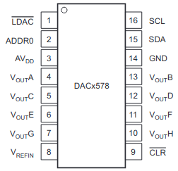
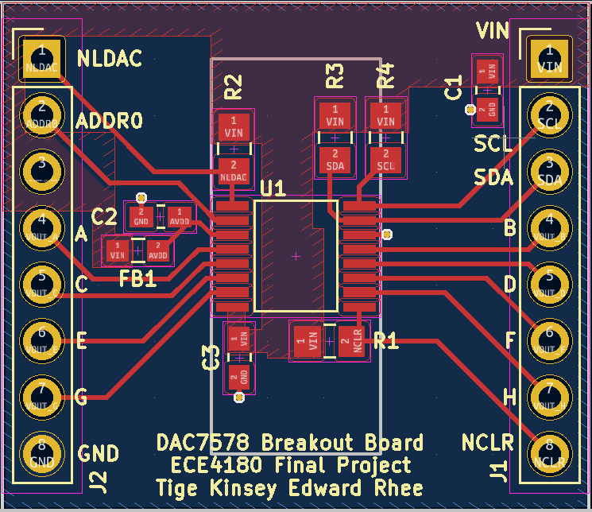
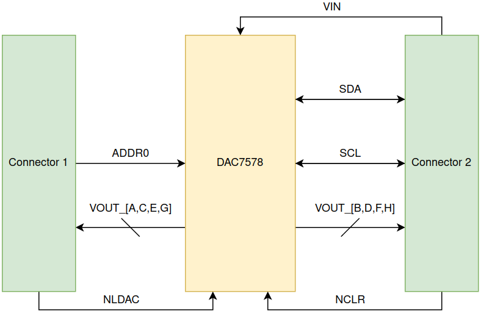
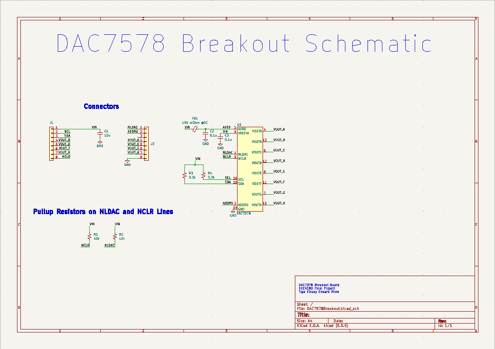
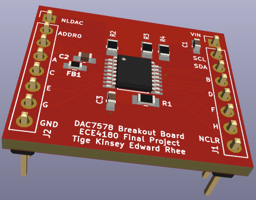

# DAC7578_Breakout
This is a breakout board for the Texas Instruments [DAC7578](https://www.ti.com/product/DAC7578). An mbed driver is also included along with a [link](https://www.digikey.com/short/53d7nqw4) containing all the components needed to assemble the board.

## Motivation
The Mbed only supports one analog output pin. We wanted the user to have more analog outputs. The DAC7578 is a 12-bit 8 channel DAC that interfaces via I2C. This gives the user 8 more analog outputs with 12 bits of precision with the sacrifice of an I2C address, 2 pins for SDA and SCL and potentially a few more pins if the user wishes to use the DAC7578's additional functionalities.

## 12-bit, Octal Channel, Ultra-Low Glitch, Voltage Output, 2-Wire Interface DAC DAC7578
The DAC7578 is a low-power, voltage-output, octal–channel, digital-to-analog converter (DAC). The device is monolithic, provides good linearity, and minimizes undesired code-to-code transient voltages (glitch).

## Notes
THE DAC7578 offers 12-bits of resolution when outputing a voltage ranging from 0 to AVDD. Power consumption is typically 2.32 mW at 3V, reducing to 0.68uW in power-down mode.

## DAC7578 Key Features
* 12 bit: 1LSB INL
* Power-On Reset to Zero Scale or Midscale
* Ultra-Low Power Operation: 0.13mA/ch at 5V
* Wide Power-Supply Range: +2.7V to +5.5V
* 2-Wire Serial Interface (I2C compatible)
* Temperature Range: -40C to +125C

## Additional Functionalities
The DAC7578 has an active low LDAC pin that allows the user to update user selected DAC channel registers asynchronously through the falling edge of the LDAC control signal. To use the DAC7578 in synchronous mode, keep LDAC tied low.

The DAC7578 also has an active low NCLR pin to clear the data stored in all the DAC channel registers to either zero scale, mid scale, or full scale voltages depending on the data stored in the clear code register. A clear activates on the falling edge of the NCLR pin.

## DAC7578 and Breakout Pinout

## Datasheet
[DAC7578 Datasheet](https://www.ti.com/lit/ds/symlink/dac7578.pdf?ts=1670937258903&ref_url=https%253A%252F%252Fgoogle.com)

## Block Diagram

## Schematic

## 3D Photo
